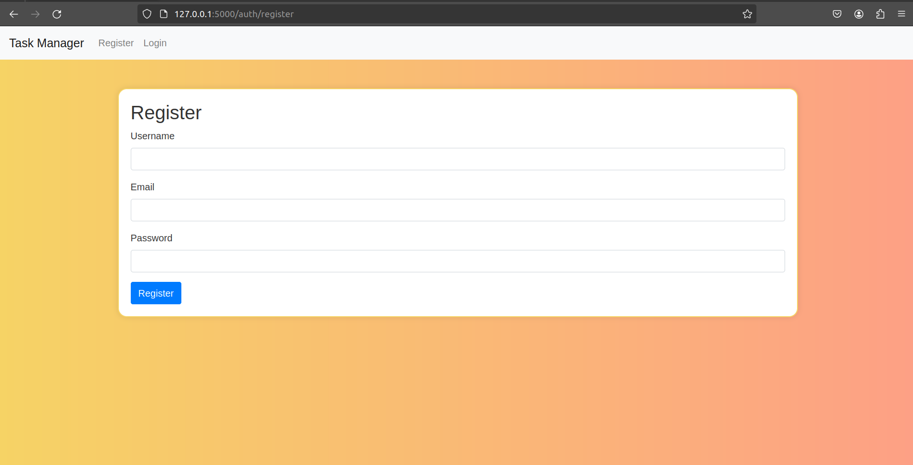
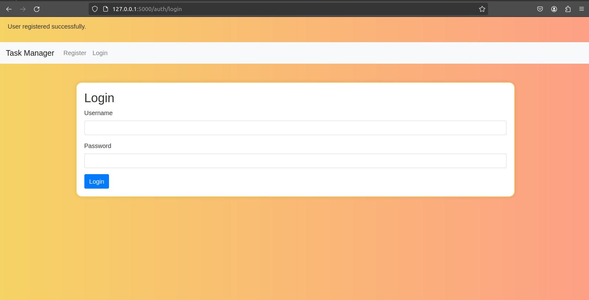
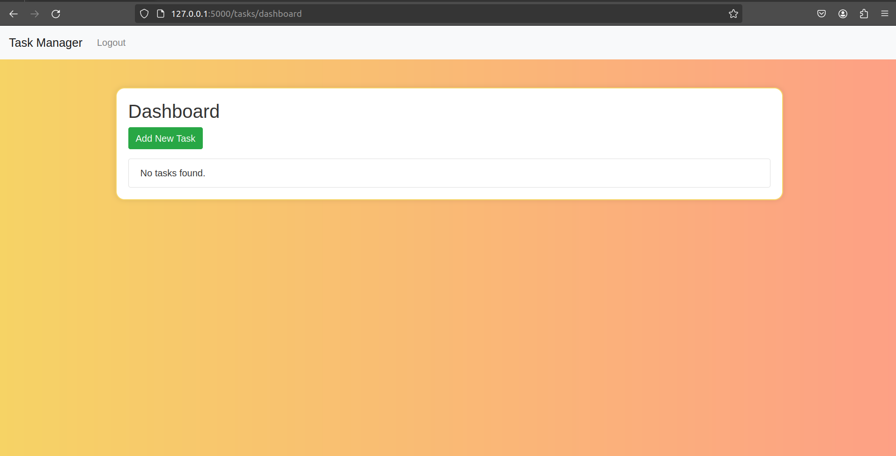
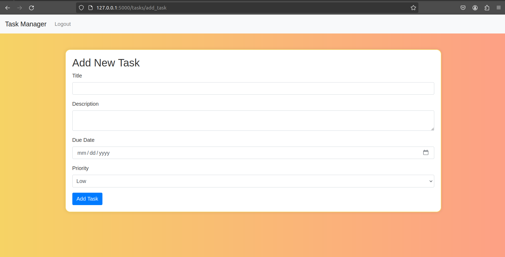
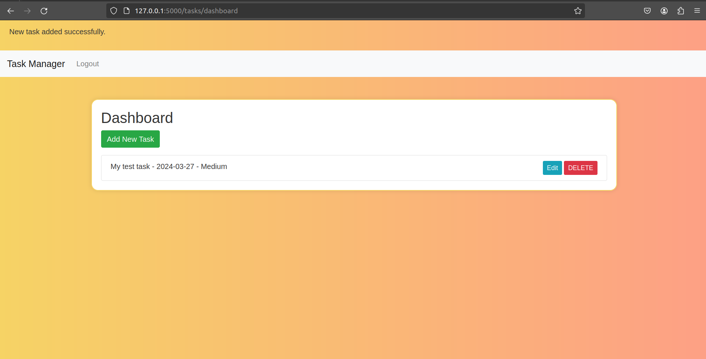
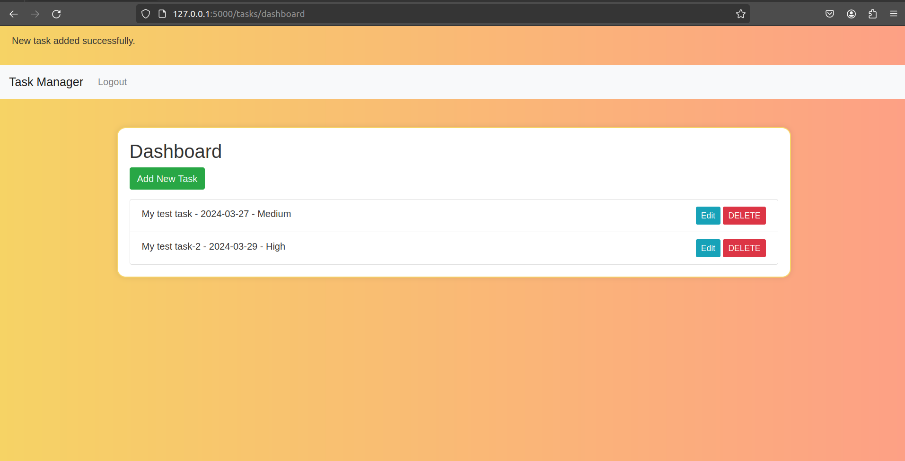
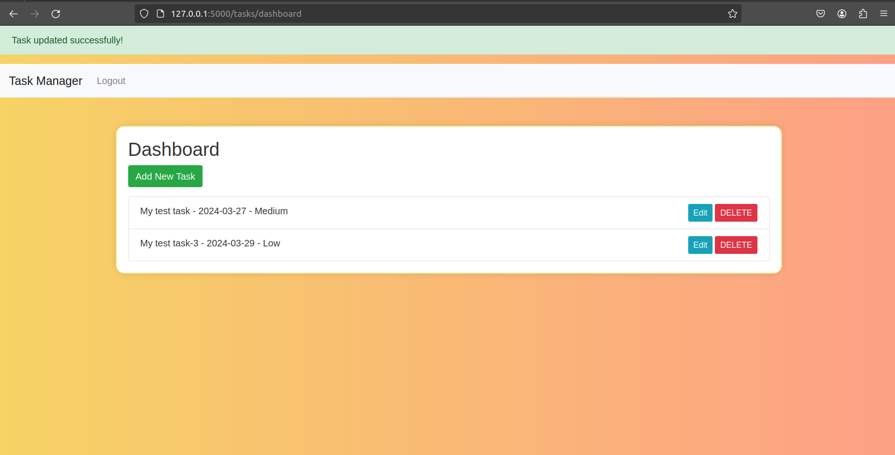
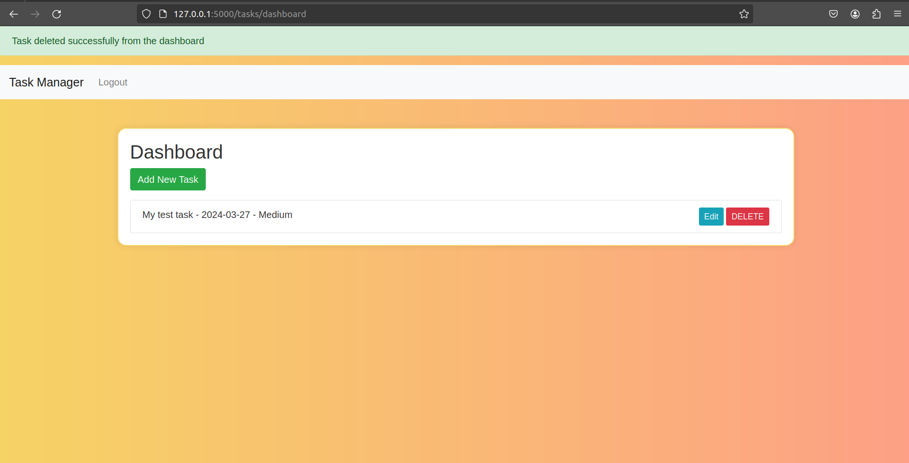
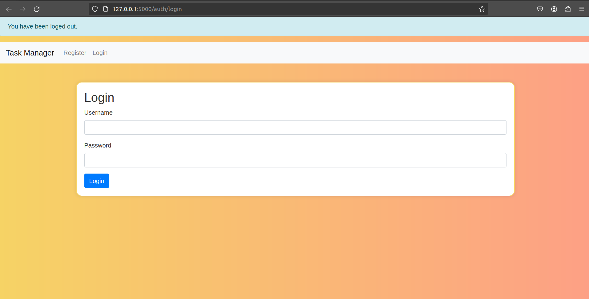

# Flask Task Management System
Its a simple and effective Task Management System built using Flask. The system provides APIs for handling task related CRUD operations.

## Features
I have made an effort to include the following basic features of a task management tool/software such as
* **User authentication** (includes user registration, login & logout)
* **Task Management** (includes adding a new task, editing an existing task & deleting an existing task)
    * Priority feature for tasks
    * Due dates for tasks
* **Swagger UI** (OpenAPI) for API documentation

## Table of Contents
- [Getting Started](#getting-started)
    - [Prerequisites](#prerequisites)
    - [Installation and Running the Web Application](#installation-and-running-the-web-application)
- [Using the Application](#using-the-application)
- [API Documentation](#api-documentation)
- [Development Setup](#development-setup)
- [Running Tests](#running-tests)
- [License](#license)

## Getting Started
### Prerquisites
Before you get started with this project / repository, make sure you have the following installed on your system:
* Docker
* docker-compose
* Python 3.10

### Installation and Running the Web Application
1. Clone my public repository:
```
git clone https://github.com/VishalAshok1504/Task-Management-System.git
cd Task-Management-System
```
2. Build and run the web application using docker
```
docker-compose up --build
```
**NOTE:** _The above command runs the application in a development environment. Setting up a development environment is discussed below under_ **Development Setup**.

3. The web application is accessible at http://localhost:5000.

### Using the application
* To register a **new user** account, navigate to '**/auth/register**'. After a new user is successfully registered, the application will automatically redirect the user to the login page.
<p align="center">
  
  <span style="font-size: 24px; vertical-align: middle;">&rarr;</span>
  
</p>
<p align="center">
  <em>Figure 1: After a successful registration, user is redirected to the Login page</em>
</p>

* To Log In an **existing user**, navigate to '**/auth/login**'.
<p align="center">
  
</p>
<p align="center">
  <em>Figure 2: Login Page</em>
</p>

* Once logged in, the user can **add**, **edit** and **delete** tasks through '**/tasks**' endpoints. Following are some browser snippets of task management operations running on my local machine.
<p align="center">
  
  <span style="font-size: 24px; vertical-align: middle;">&rarr;</span>
  
</p>
<p align="center">
  <em>Figure 3: Click on <strong>Add New Task</strong> which will redirect to <strong>/tasks/add_task</strong></em>
</p>

* After you create a new task, the application will be redirected to **/tasks/dashboard** with a flash message on top of the browser as shown below.
<p align="center">
  
</p>
<p align="center">
  <em>Figure 4: Dashboard</em>
</p>

* User can add as many tasks as he wants to and edit any existing tasks as well. 
<p align="center">
  
  <span style="font-size: 24px; vertical-align: middle;">&rarr;</span>
  
</p>
<p align="center">
  <em>Figure 5: Click on <strong>Edit</strong> which will redirect to <strong>/tasks/edit_task/task_id</strong></em>
</p>

<p align="center">
  
</p>
<p align="center">
  <em>Figure 6: Dashboard with edited task</em>
</p>

* User can delete any existing task, by clicking **DELETE**. Once deleted, it will redirect you to the dashboard with a flash message on top of the browser as shown below.
<p align="center">
  
</p>
<p align="center">
  <em>Figure 7: Dashboard with flash message</em>
</p>

* If user decides to logout, he could do so by clicking **Logout** on top left of the web page, which will redirect you back to the login page with a flash message on top of the browser as shown below.
<p align="center">
  
</p>
<p align="center">
  <em>Figure 8: Login Page with flash message</em>
</p>

### API documentation
The Swagger UI for API documentation is accessible at **'/api/docs'**. Here you can find detailed information about the request and response structures for each API endpoints as well as the Schemas. 

**NOTE:** Since I am using ***.html*** format to define my views/templates, unfortunately it could only handle ***POST*** requests. You will find similar implementation in my API documentation, i.e for ***PUT*** & ***DELETE*** I have made use of **POST** requests. 
<div align="center">
    
    <br>
    <figcaption>Figure 9: <strong>Swagger UI</strong></figcaption>
</div>

## Development Setup
Since you are using this repo for the first time, to set up a development environment, follow these steps:

1. Ensure **python** and **pip** are installed.
2. Install the required python packages using
```
pip install -r requiremnets.txt
```
3. Run 
```
flask db migrate -m"<Initial Migration message>"
flask db upgrade
```
4. To run the flask application locally:
```
flask run
```

### Running Tests
To run automated tests for this flask system, run the following command:
```
python -m unittest discover -s tests
```

### License
This project is licensed under the **MIT license** -see the **'LICENSE'** file for more details.


